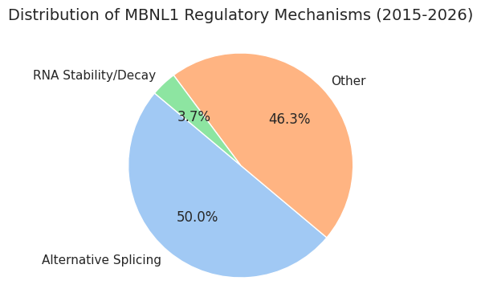
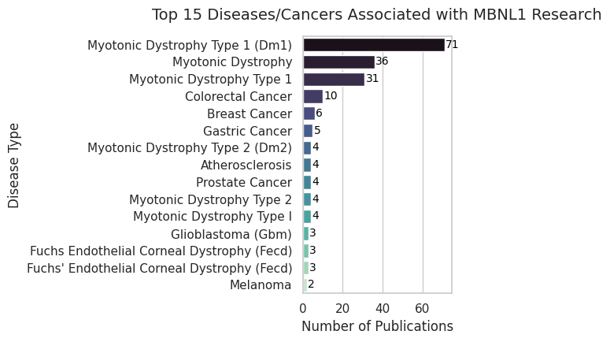

## AI-Powered Bio-Literature Miner (AI 驱动的生物医学文献挖掘中台)

### 📌 项目简介 (Project Overview)
本项目是一个专门为生物医学研究设计的自动化文献挖掘流水线。它能够针对特定的基因（如 MBNL1）、疾病（如结直肠癌）或调控机制，从 PubMed 数据库中自动抓取海量文献摘要，并利用大语言模型（LLM）进行深度语义解析，最终生成结构化的研究数据库。

本项目解决了传统人工文献调研效率低、难以定量分析的痛点，为后续的转录组学（RNA-seq）差异分析提供了高置信度的先验情报支持。

### ✨ 核心特性 (Key Features)
- **模块化设计 (Modular Architecture)**: 爬虫逻辑 (Scrapers) 与 AI 解析逻辑 (Extractors) 完全解耦，支持轻松更换底层模型（如 GPT-4, DeepSeek, GLM）。
- **多任务模板引擎 (Multi-task Template Engine)**: 支持通过命令行动态切换 Prompt 模板，适配不同的科研提取需求（如靶基因提取、临床预后分析、机制分类）。
- **自动化可视化 (Automated Visualization)**: 内置可视化模块（`utils/visualizer.py`），支持一键生成文献分布饼图、疾病关联排行等统计图表。

### 🛠️ 技术栈 (Tech Stack)
- **Language**: Python 3.8+

- **APIs**: NCBI Entrez (via Biopython), OpenAI-compatible API (DeepSeek/ZhipuAI)

- **Data Handling**: Pandas, NumPy

- **Visualization**: Matplotlib, Seaborn

- **DevOps**: Git, Dotenv, Argparse

### 🚀 快速上手 (Quick Start)
1. 克隆项目与环境准备
```bash
git clone https://github.com/ZYyli/paper_pipeline.git
cd paper_pipeline
pip install -r requirements.txt
```
2. 配置环境变量
在项目根目录创建 .env 文件，并填入你的私密 Key：
```bash
NCBI_EMAIL=your_email@example.com
DEEPSEEK_API_KEY=your_actual_api_key
```
3. 运行流水线
以检索 MBNL1 (2015年-2026年)相关的355篇文献为例：

```bash
python run_pipeline.py --query "MBNL1 AND 2015:2026[dp]" --max_results 400 --template mbnl1 --output data/processed_csv/mbnl1_all_diseases_2015_2026.csv
```

### 📊 可视化展示 (Visualization)
项目运行后，生成如下分析图表：
- ***机制分布 (Mechanism Distribution)**

- ***疾病关联排行 (Disease Ranking)**
